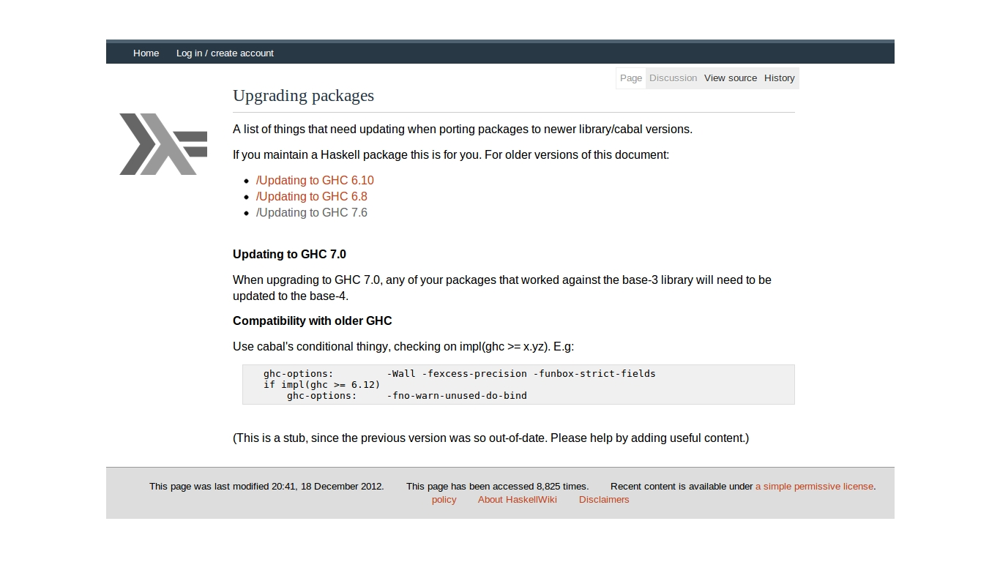
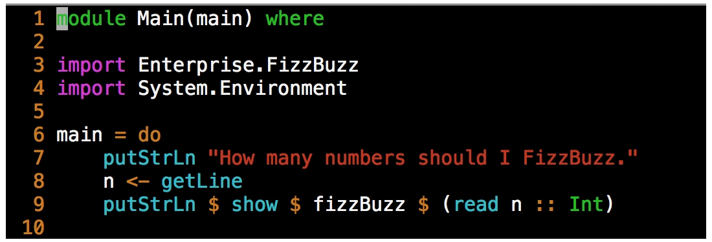
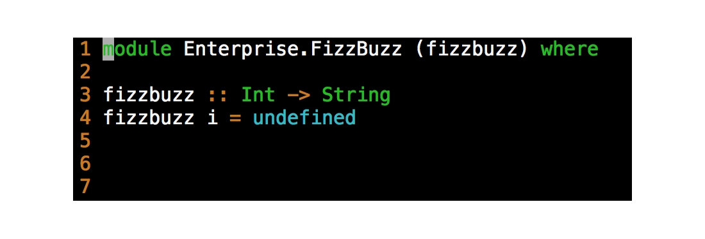
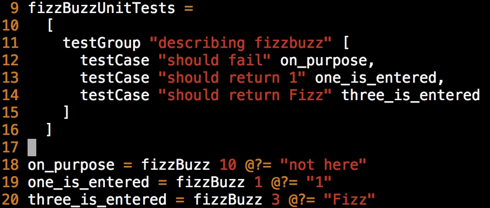

####### Cabal 

Cabal All the Things: From Init to Testing to Dist
-----------

Josh Hawkins

April 24, 2013

Forml pic
-----------

-----------

# What is Cabal?
### A Common Architecture for Building Applications and Libraries
* It describes packages in a common way allowing for distribution, organization, and cataloging.
* It describes how packages interact with the language.
* It describes what Haskell implementations support packages. 
* It provides a way to express dependency on particular libraries, compilers, or versions. 

-----------

### What is HackageDB?
* It is the central repository of open-source Haskell software.
* It functions as an upstream distribution system. 
* It provides a clean web interface for viewing and searching existing libraries.
* It provides links to dependencies.

-----------

### What is Cabal-Install?
* It's a command line interface for Cabal the Library.
* Package management - installing, downloading and dependencies
* Package development - configuring, building, testing and benchmarking
* Package sharing - packaging and uploading

-----------

Explore All the Packages
=========
### Some commands for fetching, managing and inspecting packages.
    * update 
    * list
    * install
	* unpack
	* haddock

-----------

_cabal update_
=========

### What does it do?

* This will download the most recent list of packages.
* Where is it downloading this list from?

-----------

### Take a look at the output.

      $ cabal update --verbose=3
      Downloading the latest package list from hackage.haskell.org
      Sending:
      GET /packages/archive/00-index.tar.gz HTTP/1.1
      Host: hackage.haskell.org
      User-Agent: cabal-install/1.16.0.2
      Creating new connection to hackage.haskell.org
      Received:
      HTTP/1.1 200 OK
      Date: Tue, 16 Apr 2013 13:24:07 GMT
      Server: Apache/2.2.9 (Debian) mod_python/3.3.1 Python/2.5.2
      Last-Modified: Tue, 16 Apr 2013 12:15:46 GMT
      ETag: "1888001-59f5ff-4da79543ca080"
      Accept-Ranges: bytes
      Content-Length: 5895679
      Content-Type: application/x-tar
      Content-Encoding: x-gzip
      Downloaded to
      /Users/jhawkins/Library/Haskell/repo-cache/hackage.haskell.org/00-index.tar.gz
      Updating the index cache file...
      Reading available packages...

-----------

### Lets try out "cabal list".

      $ cabal list snaplet-tasks
      * snaplet-tasks
          Synopsis: Snaplet for Snap Framework enabling developers to administrative
                    tasks akin to Rake tasks from Ruby On Rails framework.
          Default available version: 0.1.2
          Installed versions: [ Not installed ]
          License:  BSD3
      Top level overview of the package available

-----------

### Cabal lets you know...

**when your packages need an update.**

    Warning: The package list for 'hackage.haskell.org' is 17 days old.
    Run 'cabal update' to get the latest list of available packages.

**when your cabal-install needs an update.**

    Note: there is a new version of cabal-install available.
                To upgrade, run: cabal install cabal-install

-----------

_cabal install_
=========
#### It does lots of work for you.
* Grabs the Library's Dependencies.
* Grabs the Library you specified.
* Build, compiles, installs, registers, generates docs...

-----------

### Some example output

    $ cabal install snap
    Resolving dependencies...
    Downloading MonadCatchIO-transformers-0.3.0.0...
    Configuring MonadCatchIO-transformers-0.3.0.0...
    Building MonadCatchIO-transformers-0.3.0.0...
    Preprocessing library MonadCatchIO-transformers-0.3.0.0...
    [1 of 1] Compiling Control.Monad.CatchIO ( src/Control/Monad/CatchIO.hs, dist/build/Control/Monad/CatchIO.o )

-----------

### Continued…
    
    Documentation created: dist/doc/html/snap/index.html
    Installing library in
    /Users/jhawkins/Library/Haskell/ghc-7.4.2/lib/snap-0.11.2.2/lib
    Installing executable(s) in
    /Users/jhawkins/Library/Haskell/ghc-7.4.2/lib/snap-0.11.2.2/bin
    Registering snap-0.11.2.2...
    Installed snap-0.11.2.2
    Updating documentation index /Users/jhawkins/Library/Haskell/doc/index.html

-----------      

Take a look at the Source.
=========
### Get your hands dirty with "cabal unpack".
* This simply Downloads the package from Hackage
* Creates a versioned directory
* And drops the source code right there.

-----------      

### Some example output

    $ cabal unpack snap --verbose=3
    Reading available packages...
    snap-0.11.2.2 has already been downloaded.
    Unpacking to snap-0.11.2.2/
    Updating snap-0.11.2.2/snap.cabal with the latest revision from the index.

-----------

### Generate Some Documentation via "cabal haddock"
* Generates some nicely formatted html
* Documentation created: dist/doc/html/fizzbuzz/fizzbuzz/index.html
* This is another option when exploring the api of a library found on hackage.

-----------

Develop All the Packages
=========
### Commands to guide development
    * init
    * configure
    * build
    * test
    * bench
    * sdist
    * upload

-----------

### What does "cabal init" do?
#### An interactive command that aids in the generation of a .cabal file
* Guesses at obvious descriptors - name, version, author, maintainer...
* Gives some common options for the necessary fields 
* Generates a template LICENSE for you.
* Adds a specified Section - Library or Executable
* Adds descriptions and TODOs to the .cabal file

-----------

### Some example prompts

    $ Package name? [default: scratch] 
    Package version? [default: 0.1.0.0] 
    Please choose a license:
     * 1) (none)
       2) GPL-2
       3) GPL-3
       4) LGPL-2.1
       5) LGPL-3
       6) BSD3
       7) MIT
       8) Apache-2.0
       9) PublicDomain
      10) AllRightsReserved
      11) Other (specify)

-----------

### Continued…

    What does the package build:
       1) Library
       2) Executable
    Your choice? 1
    Include documentation on what each field means (y/n)? [default: n] 

-----------

.cabal All the Fields
=========

##### Defined in the PackageDescription module of cabal

* Provides a declarative description of your package.
* Contains a top level description for use by Hackage.
* Contains Build Information.
* Contains Flags
* Contains a few Sections with build information.

-----------

### Top Level Description

**A place for metadata about the package for use by Hackage**

    name:               enterpriseFizzBuzz
    version:            1.15.3.1
    synopsis:           The command-line interface for FizzBuzzing up to a number!
    description:        A very complex tool for … add lots of description here...
    homepage:           http://www.haskell.org/enterpriseFizzBuzz/
    bug-reports:        https://github.com/JHawk/enterpriseFizzBuzz/issues
    license:            BSD3
    license-file:       LICENSE
    author:             JHawk <jhawk@fizzbuzzEnterprises.com>
    maintainer:         jhawk@fizzBuzzEnterprises.com
    category:           Text

    source-repository head
      type:     git
      location: https://github.com/JHawk/enterpriseFizzBuzz/
      subdir:   FizzBuzzLib
    
-----------

### Build Description

    build-type:         Simple
    cabal-version:      >=1.8

    -- defines other files to be packaged and distributed
    extra-source-files: README bootstrap.sh
        
-----------

### A Few Common Package Build Fields

    -- some have subfields
    build-depends:
      -- prelude +
      base >= 2,
      buzz,
      -- symantic versioning 
      fizz >= 1.2 && < 1.3
      -- fizz ==1.2.*
      
    -- package level visibility only
    -- compile but don't export
    other-modules:  
        EnterpriseFizzBuzz.FizzBuzz
 
    -- Some specify specific variables
    buildable: false
    hs-source-dirs: src/FizzBuzz
    
    -- Some set flags or tokens
    ghc-options: -Wall -fwarn-tabs

-----------

### Conditional Thingy
    if impl(ghc <= 7.4.2)
      build-depends:
        bytestring >= 0.9.1 && <0.10
    else
      build-depends:
        bytestring >= 0.10.0 && <0.11

-----------

### Define Your Own Condtional Thingy

**Define it at top level**

    flag build-stuff
      description: Build if True
      default: False

**Conditional logic in your .cabal Sections** 

    if flag(build-stuff)
      buildable: True
      build-depends: someSpecialDep
    else
      buildable: False

**Use it via _cabal configure_**

    $ cabal configure --flags=build-stuff

-----------

-----------
 
.cabal Sections
=========

### Library Section

**Requires exposed-modules**

Describes modules exposed to those using your package

    library
      build-depends:
        base         >= 4 && <= 5 
      
      other-modules:
        EnterpriseFizzBuzz.HiddenStuff
      
      exposed-modules:  
          EnterpriseFizzBuzz.Fizz
        , EnterpriseFizzBuzz.Buzz
        , EnterpriseFizzBuzz.FizzBuzz

-----------

### Executable Section

**Requires Main-Is, Unique Identifier** 

Describes an executable runnable from the command line

    executable enterpriseFizzBuzz
      build-depends:     base ==4.5.*
      hs-source-dirs:    src
  
      main-is:           Main.hs
      
      -- alternatively 
      -- main-is:     src/Main.hs

Are exposed-modules available?

-----------

### Test-Suite Section

**Requires Unique Identifier, Main-Is, Type** 

Executable that indicates failure with a non-zero exit code.

    test-suite enterpriseUnit
      build-depends:     base ==4.5.*
                       , HUnit
                       , test-framework
                       , test-framework-hunit
                       , enterpriseFizzBuzz
    
      hs-source-dirs:    test-suite/unit
    
      type:              exitcode-stdio-1.0
      main-is:           Enterprise/FizzBuzzUnitTests.hs

Are exposed-modules available?

-----------

### Benchmark Section

**Requires Unique Identifier, Main-Is, Type** 

Executable that indicates failure with a non-zero exit code.
    
    benchmark enterpriseBench
      build-depends:     base ==4.5.*
                       , criterion
                       , enterpriseFizzBuzz
    
      hs-source-dirs:    bench
    
      type:              exitcode-stdio-1.0
      main-is:           Enterprise/FizzBuzzBenchmarks.hs

Are exposed-modules available?

-----------

### Look at a Complete .cabal File.

-----------

Create All the Code
=========

### Simple Main

**src/Main.hs**

-----------

### Stub Module in Library

**src/Enterprise/FizzBuzz.hs**

-----------

Run All the Code
=========

### What does "cabal configure" do?

**Prepares to build the package**

* Looks for available packages
* Tries to resolve dependecies
* Decides which tools to use
* Tells which dependecies aren't available
    
-----------

### What does "cabal build" do?
* Runs cabal configure with most recently used options.
* Creates dist/build
* Builds the package and puts it in dist/build/enterpriseFizzBuzz/enterpriseFizzBuzz

-----------

### What happens when I run it?
    $ cabal configure && cabal build
    $ ./dist/build/enterpriseFizzBuzz/enterpriseFizzBuzz
	How many numbers should I FizzBuzz.
	4
	enterpriseFizzBuzz: Prelude.undefined

-----------

Test All the Code
=========

### with test-framework

* Test in parallel 
* Report in deterministic order
* Supports Unit as well as Invariant tests

**** may remove

* Add your own test providers above and beyond those provided.
* Reports failing seeds for QuickCheck

-----------

### HUnit
* HUnit is an adaptation of JUnit
* Use test-framework-hunit provider
* More description

-----------

### A few HUnit tests

-----------

### Run it with "cabal test"!

    $ cabal configure --enable-tests && cabal build && cabal test
    $ cabal configure --disable-tests && cabal build

* What does it do?
* Do the test-suite deps get added to the build if not enabled?

-----------

### How can I run my benchmarks?
    
    $ cabal configure --enable-benchmarks && cabal build && cabal bench
    $ cabal configure --disable-benchmarks && cabal build

-----------

### Enjoying the nice html output.

     $ ./dist/build/enterpriseBench/enterpriseBench -o enterpriseBench.html

-----------

### How do I get this code out the door?
#### _cabal sdist_
* Building source dist for fizzbuzz-0.1.0.0...
* Preprocessing executable 'fizzbuzz' for fizzbuzz-0.1.0.0...
* Source tarball created: dist/fizzbuzz-0.1.0.0.tar.gz

-----------

#### For those who want to give back, 
### _cabal upload_
* Requires a Hackage username and password.
* Uploads your package to Hackage.

-----------

### For More Information
    $ cabal unpack cabal && cd Cabal-1.16.*** && cabal configure && cabal haddock

-----------

-----------

-----------

.

-----------

“Languages flourish when libraries are plentiful, reliable, and well documented.” - Simon Peyton Jones

### Extending Cabal

### A more Custom Build

* Uses Setup.hs or Setup.lhs.
* TODO - Custom build and setup.hs
* look at darcs
### Define your own task API?

--------

### QuickCheck if i have time
* blah
* blah
* blah

-----------

### detailed (may not be available yet)
* Preferred method for writing tests.
* Produces more detailed human and machine readable results.
* Requires a test-module field : The module exporting the tests.

example 
    
    test-suite detailed-fizzbuzz-tests
        build-depends: 
          base,
          test-framework,
          test-framework-hunit,
          test-framework-quickcheck2,
          HUnit,
          QuickCheck
        
        type:       detailed-1.0
        
        test-module: FizzBuzz.Tests

-----------