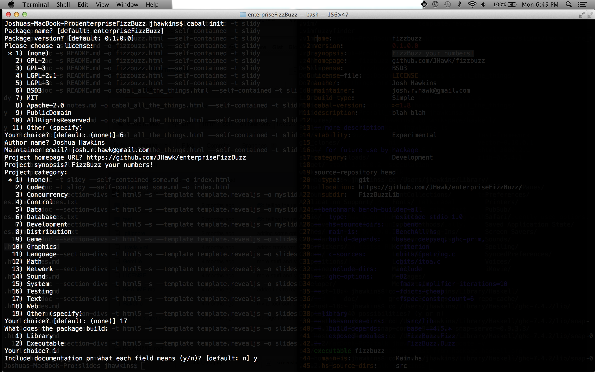

## Cabal All the Things: From Init to Testing to Dist
Josh Hawkins

April 24, 2013

-----------

-----------

### What is Cabal?
##### A Common Architecture for Building Applications and Libraries
* It describes packages in a common way allowing for distribution, organization, and cataloging.
* It describes how packages interact with the language.
* It describes what Haskell implementations support packages. 
* It provides a way to express dependency on particular libraries, compilers, or versions. 

“Languages flourish when libraries are plentiful, reliable, and well documented.” - Simon Peyton Jones

-----------

### What is HackageDB?
* It is the central repository of open-source Haskell software.
* It functions as an upstream distribution system. 
* It provides a clean web interface for viewing and searching existing libraries.
* It provides links to dependencies.

-----------

### What is Cabal-Install?
* It's a command line interface for cabal the Library.
* Package management - installing, downloading and dependencies. 
* Package development - building, testing and uploading packages.

-----------

### Explore All the Packages
    * update 
    * list
    * install
	* unpack

-----------

### What does _cabal update_ do?
* This will download the most recent list of packages.
* Where is it downloading this list from?

-----------

example using the **update** command:

      $ cabal update --verbose=3
      Downloading the latest package list from hackage.haskell.org
      Sending:
      GET /packages/archive/00-index.tar.gz HTTP/1.1
      Host: hackage.haskell.org
      User-Agent: cabal-install/1.16.0.2
      Creating new connection to hackage.haskell.org
      Received:
      HTTP/1.1 200 OK
      Date: Tue, 16 Apr 2013 13:24:07 GMT
      Server: Apache/2.2.9 (Debian) mod_python/3.3.1 Python/2.5.2
      Last-Modified: Tue, 16 Apr 2013 12:15:46 GMT
      ETag: "1888001-59f5ff-4da79543ca080"
      Accept-Ranges: bytes
      Content-Length: 5895679
      Content-Type: application/x-tar
      Content-Encoding: x-gzip
      Downloaded to
      /Users/jhawkins/Library/Haskell/repo-cache/hackage.haskell.org/00-index.tar.gz
      Updating the index cache file...
      Reading available packages...

-----------

### Sometimes Cabal will tell you to run an update.
    Warning: The package list for 'hackage.haskell.org' is 17 days old.
    Run 'cabal update' to get the latest list of available packages.

-----------
 
### Sometimes Cabal will tell you cabal-install needs an update
    Note: there is a new version of cabal-install available.
                To upgrade, run: cabal install cabal-install

-----------

### Lets try out _cabal list_.
Once that's done searching for the latest package is simple using the **list** command:

      $ cabal list snaplet-tasks
      * snaplet-tasks
          Synopsis: Snaplet for Snap Framework enabling developers to administrative
                    tasks akin to Rake tasks from Ruby On Rails framework.
          Default available version: 0.1.2
          Installed versions: [ Not installed ]
          License:  BSD3
      Top level overview of the package available

-----------

### What does _cabal install_ do?
* Resolving dependencies...
* Grabs the Library's Dependencies.
* Grabs the Library you specified.
* Build, compiles, installs, registers, generates docs...

-----------

    $ cabal install snap
    Resolving dependencies...
    Downloading MonadCatchIO-transformers-0.3.0.0...
    Configuring MonadCatchIO-transformers-0.3.0.0...
    Building MonadCatchIO-transformers-0.3.0.0...
    Preprocessing library MonadCatchIO-transformers-0.3.0.0...
    [1 of 1] Compiling Control.Monad.CatchIO ( src/Control/Monad/CatchIO.hs, dist/build/Control/Monad/CatchIO.o )

-----------
    
    Documentation created: dist/doc/html/snap/index.html
    Installing library in
    /Users/jhawkins/Library/Haskell/ghc-7.4.2/lib/snap-0.11.2.2/lib
    Installing executable(s) in
    /Users/jhawkins/Library/Haskell/ghc-7.4.2/lib/snap-0.11.2.2/bin
    Registering snap-0.11.2.2...
    Installed snap-0.11.2.2
    Updating documentation index /Users/jhawkins/Library/Haskell/doc/index.html

-----------      

##### If you really want to know what a package is doing,
### _cabal unpack_
* This simply Downloads the package from Hackage
* Creates a versioned directory
* And drops the source code right there.

-----------

    $ cabal unpack snap --verbose=3
    Reading available packages...
    snap-0.11.2.2 has already been downloaded.
    Unpacking to snap-0.11.2.2/
    Updating snap-0.11.2.2/snap.cabal with the latest revision from the index.

-----------

### Develop All the Packages
    * init
    * configure
    * build
    * test
    * bench
    * sdist
    * upload

-----------

### What does _cabal init_ do?
* An interactive command that aids in the generation of a .cabal file.
* Coaches you through the pains of getting a simple .cabal file filled out the first time.
    
    * Guesses at obvious descriptors - name, version, author, maintainer...
    * Gives some common options for the necessary fields 
    * Generates a template LICENSE for you.
    * Adds a specified Section - Library or Executable
    * Adds descriptions and TODOs to the .cabal file

-----------

-----------

### .cabal All the Fields
Defined in the PackageDescription module of cabal
    
    * Provides a declarative description of your package.
    * Contains a top level description for use by Hackage.
    * Contains Build Information.
    * Contains Flags
    * Contains a few Sections with build information.
        Library
        Executable
        TestSuite
        Benchmark

-----------

### Top Level Description
A place for all the metadata about the package for use by Hackage.

    name:               enterpriseFizzBuzz
    version:            1.15.3.1
    synopsis:           The command-line interface for FizzBuzzing up to a number!
    description:        A very complex tool for taking a number from the command line and printing a formatted string that replaces numbers divisible by 3 with 'Fizz', numbers divisible by 5 with 'Buzz' and numbers divisible by 3 and 5 with 'FizzBuzz'.
    homepage:           http://www.haskell.org/enterpriseFizzBuzz/
    bug-reports:        https://github.com/JHawk/enterpriseFizzBuzz/issues
    license:            BSD3
    license-file:       LICENSE
    author:             JHawk <jhawk@fizzbuzzEnterprises.com>
    maintainer:         jhawk@fizzBuzzEnterprises.com
    copyright:          2013 JHawk <jhawk@fizzbuzzEnterprises.com>
    category:           Text
	tested-with:        GHC == 7.0.2

    source-repository head
      type:     git
      location: https://github.com/JHawk/enterpriseFizzBuzz/
      subdir:   FizzBuzzLib
    
    -- defines other files to be packaged and distributed
    extra-source-files: README bootstrap.sh

-----------

### Required Build Description
    build-type:         Simple 
    cabal-version:      >=1.8
    
-----------

### A Few Common Package Build Fields

Some have subfields.

    build-depends:
      -- prelude +
      base >= 2,
      buzz,
      -- symantic versioning 
      fizz >= 1.2 && < 1.3
      -- fizz ==1.2.*
      
    -- private : package level visibility
    -- compile but don't export
    other-modules:  
        EnterpriseFizzBuzz.Fizz,
        EnterpriseFizzBuzz.Buzz,
        EnterpriseFizzBuzz.FizzBuzz

-----------

Some specify specific variables.
 
    buildable: false
    hs-source-dirs: src/FizzBuzz

-----------
    
Some set flags or tokens.
    
    ghc-options: -Wall -fwarn-tabs -threaded
    extensions: CPP, ForeignFunctionInterface // TODO

-----------

### Conditional Thingy
    if impl(ghc <= 7.4.2)
      build-depends:
        bytestring >= 0.9.1 && <0.10
    else
      build-depends:
        bytestring >= 0.10.0 && <0.11

-----------

### Define Your Own Flag Thingy
    flag benchmarks
      description: Build the benchmarks
      default: False
 
    if flag(benchmarks)
      buildable: True
      build-depends: criterion
    else
      buildable: False        

-----------

-----------
 
### Use it via _cabal configure_
    $ cabal configure --flags=benchmarks

-----------

### Library Section
##### Requires exposed-modules
* All modules are either exposed-modules or other-modules.
* Contains fields and subsections for describing how to build the library.

-----------

    library
      build-depends:
        base         >= 4 && <= 5 
      
      other-modules:
        EnterpriseFizzBuzz.HiddenStuff
      
      exposed-modules:  
        EnterpriseFizzBuzz.Fizz,
        EnterpriseFizzBuzz.Buzz,
        EnterpriseFizzBuzz.FizzBuzz

-----------

### Executable Section
##### Main-Is is the main difference.
##### Requires Main-Is, Unique Identifier

-----------
    
    executable enterpriseFizzBuzz
      ghc-options: -Wall -threaded
      if impl(ghc >= 6.8)
        ghc-options: -fwarn-tabs
      
      other-modules:
        Command.ParseNumber
        
      build-depends: 
        base     >= 4 && <= 5, 
        network  >= 1 && < 3,
		fizzBuzz

      hs-source-dirs: src/
      main-is:        Main.hs

      -- alternatively 
      -- main-is:     src/Main.hs

-----------

### Test-Suite Section
##### Requires Unique Identifier, Main-Is, Type 
* Describes executables that indicate failure with a non-zero exit code.
* more description

-----------
  
    test-suite fizzbuzz-tests
      hs-source-dirs: tests
      build-depends:
        base,
        test-framework,
        test-framework-hunit,
        test-framework-quickcheck2,
        HUnit,
        QuickCheck,
        enterpriseFizzBuzz

      main-is: UnitTests.hs

      type: exitcode-stdio-1.0

-----------

### Benchmark Section
##### Requires Unique Identifier, Main-Is, Type 
* Describes executables that indicate failure with a non-zero exit code.
* more description

-----------
    
    benchmark fizzbuzz-benchmarker
      type:             exitcode-stdio-1.0
      main-is:          FizzBuzzBench.hs
      build-depends:    base, criterion

-----------

### Look at a Complete .cabal File.

-----------

### How can I build / run it?
    $ cabal configure && cabal build

-----------

### What does _cabal configure_ do?
* Prepares to build the package.
* Looks for available packages -> Reading available packages...
* Tries to resolve dependecies -> Resolving dependencies...
* Decides which tools to use   -> Using tar found on system at : /usr/bin/tar
* At least the following dependencies are missing:
  GraphSCC ==1.0.3,
  HStringTemplate ==0.6.12,
  … 

-----------

#### What does _cabal build_ do?
* Runs cabal configure with most recently used options.
* Creates dist/build
* Builds the package and puts it in ./dist/build/fizzbuzz

-----------

### How can I run my tests?
    $ cabal configure --enable-tests && cabal build && cabal test
    $ cabal configure --disable-tests && cabal build

-----------

### How can I run my benchmarks?
    $ cabal configure --enable-benchmarks && cabal build && cabal bench
    $ cabal configure --disable-benchmarks && cabal build

-----------

### Generate Some Documentation via _cabal haddock_
* Generates some nicely formatted html.
* Documentation created: dist/doc/html/fizzbuzz/fizzbuzz/index.html
* This is another option when exploring the api of a library found on hackage.

-----------

### How do I get this code out the door?
#### _cabal sdist_
* Building source dist for fizzbuzz-0.1.0.0...
* Preprocessing executable 'fizzbuzz' for fizzbuzz-0.1.0.0...
* Source tarball created: dist/fizzbuzz-0.1.0.0.tar.gz

-----------

#### For those who want to give back, 
### _cabal upload_
* Requires a Hackage username and password.
* Uploads your package to Hackage.

-----------

### For More Information
    $ cabal unpack cabal && cd Cabal-1.16.*** && cabal configure && cabal haddock

-----------

-----------
### Extending Cabal

### A more Custom Build

* Uses Setup.hs or Setup.lhs.
* TODO - Custom build and setup.hs

### Define your own task API?

### detailed (may not be available yet)
* Preferred method for writing tests.
* Produces more detailed human and machine readable results.
* Requires a test-module field : The module exporting the tests.

example 
    
    test-suite detailed-fizzbuzz-tests
        build-depends: 
          base,
          test-framework,
          test-framework-hunit,
          test-framework-quickcheck2,
          HUnit,
          QuickCheck
        
        type:       detailed-1.0
        
        test-module: FizzBuzz.Tests

-----------