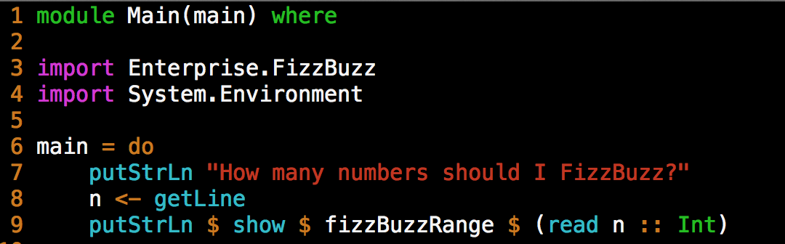
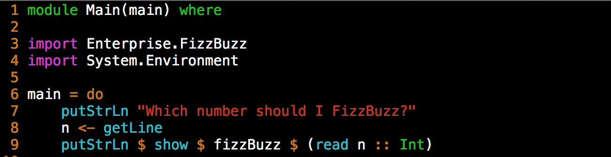
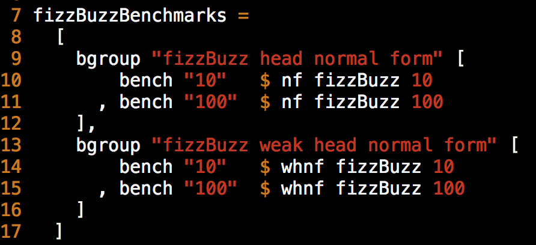

####### Cabal 

Cabal All the Things: From Init to Testing to Dist
-----------

Josh Hawkins

April 24, 2013

Shameless Promotion
-----------

* Intended to approximate the type safety of Haskell with the expressiveness of Ruby 
* Compiles to JS for all your web needs
* Functional, strict, expressive, pure(ish), static(y), inferred, fast, fun
* Strong like a gorilla, yet soft and yielding like a Nerf ball

-----------

-----------

# What is Cabal?
### A Common Architecture for Building Applications and Libraries
* It describes packages in a common way allowing for distribution, organization, and cataloging.
* It describes how packages interact with the language.
* It describes what Haskell implementations support packages. 
* It provides a way to express dependency on particular libraries, compilers, or versions. 

-----------

### What is HackageDB?
* It is the central repository of open-source Haskell software.
* It functions as an upstream distribution system. 
* It provides a clean web interface for viewing and searching existing libraries.
* It provides links to dependencies.

-----------

### What is Cabal-Install?
* It's a command line interface for Cabal the Library.
* Package management - installing, downloading and dependencies
* Package development - configuring, building, testing and benchmarking
* Package sharing - packaging and uploading

-----------

Explore All the Packages
=========
### Some commands for fetching, managing and inspecting packages.
    * update 
    * list
    * install
	* unpack
	* haddock

-----------

_cabal update_
=========

### What does it do?

* This will download the most recent list of packages.
* Where is it downloading this list from?

**Run it anywhere**

-----------

### Take a look at the output.

      $ cabal update --verbose=3
      Downloading the latest package list from hackage.haskell.org
      Sending:
      GET /packages/archive/00-index.tar.gz HTTP/1.1
      Host: hackage.haskell.org
      User-Agent: cabal-install/1.16.0.2
      Creating new connection to hackage.haskell.org
      Received:
      HTTP/1.1 200 OK
      ...
      Downloaded to
      /Users/jhawkins/Library/Haskell/repo-cache/hackage.haskell.org/00-index.tar.gz
      Updating the index cache file...
      Reading available packages...

-----------

### Lets try out _cabal list_.

      $ cabal list snaplet-tasks
      * snaplet-tasks
          Synopsis: Snaplet for Snap Framework enabling developers to administrative
                    tasks akin to Rake tasks from Ruby On Rails framework.
          Default available version: 0.1.2
          Installed versions: [ Not installed ]
          License:  BSD3
      Top level overview of the package available

**Run it anywhere**

-----------

### Cabal lets you know...

**when your packages need an update.**

    Warning: The package list for 'hackage.haskell.org' is 17 days old.
    Run 'cabal update' to get the latest list of available packages.

**when your cabal-install needs an update.**

    Note: there is a new version of cabal-install available.
                To upgrade, run: cabal install cabal-install

-----------

_cabal install_
=========

#### It does lots of work for you.
**Give it a package name from the list**

* Grabs the Library's Dependencies.
* Grabs the Library you specified.
* Build, compiles, installs, registers, generates docs...
* Installs library in a common place
* Installs executable(s) in a common place

-----------

### Some example output

    $ cabal install snap
    Resolving dependencies...
    Downloading MonadCatchIO-transformers-0.3.0.0...
    Configuring MonadCatchIO-transformers-0.3.0.0...
    Building MonadCatchIO-transformers-0.3.0.0...
    Preprocessing library MonadCatchIO-transformers-0.3.0.0...
    [1 of 1] Compiling Control.Monad.CatchIO ( src/Control/Monad/CatchIO.hs, dist/build/Control/Monad/CatchIO.o )

-----------

### Continued…
    
    Documentation created: dist/doc/html/snap/index.html
    Installing library in
    /Users/jhawkins/Library/Haskell/ghc-7.4.2/lib/snap-0.11.2.2/lib
    Installing executable(s) in
    /Users/jhawkins/Library/Haskell/ghc-7.4.2/lib/snap-0.11.2.2/bin
    Registering snap-0.11.2.2...
    Installed snap-0.11.2.2
    Updating documentation index /Users/jhawkins/Library/Haskell/doc/index.html

-----------      

Take a look at the Source.
=========

### Get your hands dirty with _cabal unpack_.

* This simply Downloads the package from Hackage
* Creates a versioned directory
* And drops the source code right there.

**Run it somwhere for source code**

-----------      

### Some example output

    $ cabal unpack snap --verbose=3
    Reading available packages...
    snap-0.11.2.2 has already been downloaded.
    Unpacking to snap-0.11.2.2/
    Updating snap-0.11.2.2/snap.cabal with the latest revision from the index.

-----------

### Generate some documentation via _cabal haddock_.

* Generates some nicely formatted html
* Documentation created: dist/doc/html/fizzbuzz/fizzbuzz/index.html
* This is another option when exploring the api of a library found on hackage.

**Run it from the root of the package**

-----------

Develop All the Packages
=========

### Commands to guide development
    * init
    * configure
    * build
    * test
    * bench
    * sdist
    * upload

-----------

What does "cabal init" do?
=========

#### An interactive command that aids in the generation of a .cabal file

* Guesses at obvious descriptors - name, version, author, maintainer...
* Gives some common options for the necessary fields 
* Generates a template LICENSE for you.
* Adds a specified Section - Library or Executable
* Adds descriptions and TODOs to the .cabal file

**Run it from a new dir**

-----------

### Some example prompts

    $ Package name? [default: scratch] 
    Package version? [default: 0.1.0.0] 
    Please choose a license:
     * 1) (none)
       2) GPL-2
       3) GPL-3
       4) LGPL-2.1
       5) LGPL-3
       6) BSD3
       7) MIT
       8) Apache-2.0
       9) PublicDomain
      10) AllRightsReserved
      11) Other (specify)

-----------

### Continued…

    What does the package build:
       1) Library
       2) Executable
    Your choice? 1
    Include documentation on what each field means (y/n)? [default: n] 

-----------

.cabal All the Fields
=========
##### Provides a declarative description of your package

* Defined in the PackageDescription module of cabal 
* Contains a top level description for use by Hackage
* Contains Build Information
* Contains Flags
* Contains the Core Sections of your Package

-----------

### Top Level Description

**A place for metadata about the package for use by Hackage**

    name:               enterpriseFizzBuzz
    version:            1.15.3.1
    synopsis:           The command-line interface for FizzBuzzing up to a number!
    description:        A very complex tool for … add lots of description here...
    homepage:           http://www.haskell.org/enterpriseFizzBuzz/
    bug-reports:        https://github.com/JHawk/enterpriseFizzBuzz/issues
    license:            BSD3
    license-file:       LICENSE
    author:             JHawk <jhawk@fizzbuzzEnterprises.com>
    maintainer:         jhawk@fizzBuzzEnterprises.com
    category:           Text

    source-repository head
      type:     git
      location: https://github.com/JHawk/enterpriseFizzBuzz/
      subdir:   FizzBuzzLib
    
-----------

### Build Description

    build-type:         Simple
    cabal-version:      >=1.8

    -- defines other files to be packaged and distributed
    extra-source-files: README bootstrap.sh
        
-----------

### A Few Common Package Build Fields

    -- some have subfields
    build-depends:
      -- prelude +
      base >= 2,
      buzz,
      -- semantic versioning 
      fizz >= 1.2 && < 1.3
      -- fizz ==1.2.*
      
    -- package level visibility only
    -- compile but don't export
    other-modules:  
        EnterpriseFizzBuzz.FizzBuzz
 
    -- Some specify specific variables
    buildable: false
    hs-source-dirs: src/FizzBuzz
    
    -- Some set flags or tokens
    ghc-options: -Wall -fwarn-tabs

-----------

### Conditional Thingy
  
    if impl(ghc <= 7.4.2)
      build-depends:
        bytestring >= 0.9.1 && <0.10
    else
      build-depends:
        bytestring >= 0.10.0 && <0.11

-----------

### Define Your Own Conditional Thingy

**Define it at top level**

    flag build-stuff
      description: Build if True
      default: False

**Conditional logic in your .cabal Sections** 

    if flag(build-stuff)
      buildable: True
      build-depends: someSpecialDep
    else
      buildable: False

**Use it via _cabal configure_**

    $ cabal configure --flags=build-stuff

-----------

-----------
 
.cabal Sections
=========

### Defining the code's structure and build
* Defines individual targets for cabal to build
* Provides a description of how to build the target
* Describes your code's [structure](http://www.haskell.org/haskellwiki/Structure_of_a_Haskell_project)

### Library Section

**Requires Exposed-Modules**

Describes modules exposed internal to this package and to the package's consumer

    library
      build-depends:
        base         >= 4 && <= 5 
      
      other-modules:
        EnterpriseFizzBuzz.HiddenStuff
      
      -- Adding .hs to the end will fail on configuration.
      exposed-modules:  
          EnterpriseFizzBuzz.Fizz
        , EnterpriseFizzBuzz.FizzBuzz

There can be only one

-----------

### Executable Section

**Requires Unique Identifier, Main-Is** 

Describes an executable runnable from the command line

    executable enterpriseFizzBuzz
      build-depends:     base ==4.5.*
      hs-source-dirs:    src
  
      main-is:           Main.hs
      
      -- alternatively 
      -- main-is:     src/Main.hs

Can define more than one

-----------

### Test-Suite Section

**Requires Unique Identifier, Main-Is, Type, Package Identifier** 

Executable that indicates failure with a non-zero exit code

    test-suite enterpriseUnit
      build-depends:     base ==4.5.*
                       , HUnit
                       , test-framework
                       , test-framework-hunit
                       , enterpriseFizzBuzz
    
      hs-source-dirs:    test-suite/unit
    
      type:              exitcode-stdio-1.0
      main-is:           Enterprise/FizzBuzzUnitTests.hs

Can define more than one.

-----------

### Benchmark Section

**Requires Unique Identifier, Main-Is, Type, Package Identifier** 

Very much like the test-suite section
    
    benchmark enterpriseBench
      build-depends:     base ==4.5.*
                       , criterion
                       , enterpriseFizzBuzz
    
      hs-source-dirs:    bench
    
      type:              exitcode-stdio-1.0
      main-is:           Enterprise/FizzBuzzBenchmarks.hs

Can define more than one.

-----------

### Look at a Complete .cabal File.

-----------

Create All the Code
=========

### FizzBuzz

Write a program that prints the numbers from 1 to 100. But for multiples of three print “Fizz” instead of the number and for the multiples of five print “Buzz”. For numbers which are multiples of both three and five print “FizzBuzz”.

-----------

### Simple Main for FizzBuzz

**src/Main.hs**

-----------

### Another Main for FizzBuzzing Single Numbers

**src/SingleMain.hs**

-----------

### Stub Module in Library

**src/Enterprise/FizzBuzz.hs**

-----------

Run All the Code
=========

### What does "cabal configure" do?

* Prepares to build the package
* Looks for available packages
* Tries to resolve dependencies
* Decides which tools to use
* Tells which dependencies aren't available

**Run it from the root of the package**
    
-----------

### What does "cabal build" do?

* Runs cabal configure with most recently used options.
* Creates dist/build
* Builds the package and puts it in dist/build/enterpriseFizzBuzz/enterpriseFizzBuzz

**Run it from the root of the package**

-----------

### What happens when I run it?
    $ cabal configure && cabal build
    $ ./dist/build/enterpriseFizzBuzz/enterpriseFizzBuzz
	How many numbers should I FizzBuzz.
	4
	enterpriseFizzBuzz: Prelude.undefined

-----------

Test All the Code
=========

### Using test-framework
**A test framework for combining tests made using QuickCheck and HUnit and much more…**

* Test in parallel
* Report in deterministic order (same input, same output)
* Supports Unit as well as Invariant tests via Providers
* Supports test grouping and assertions

-----------

### Unit Testing with HUnit
* HUnit is an adaptation of JUnit 
* Provides functions for writing Assertions
* Assertions are types that on failure will output a message

### Some functions for generating assertions

    assertEqual :: (Eq a, Show a) => String -> a -> a -> Assertion
    
    (@=?) :: (Eq a, Show a) => a -> a -> Assertion
    
    (@?=) :: (Eq a, Show a) => a -> a -> Assertion
    
    (@?) :: AssertionPredicable t => t -> String -> Assertion

-----------

### HUnit Provider and the Test Framework
HUnit Provider generates a Test from an Assertion

    testCase :: TestName -> Assertion -> Test

Test Framework groups the tests

    testGroup :: TestName -> [Test] -> TestSource

-----------

### A few HUnit tests

-----------

### Run it with _cabal test_.

Pass configure flags to enable test building
 
    $ cabal configure --enable-tests && cabal build && cabal test
    
Test will report your error

    Running 1 test suites...
    Test suite enterpriseUnit: RUNNING...
    Fizz Buzz Unit Test Cases:
      should return empty string: [Failed]
    ERROR: Prelude.undefined 

Pass configure flags to disable test building

    $ cabal configure --disable-tests && cabal build

**Run it from the root of the package**

-----------

### Lets make them pass!

-----------

### Some output from our Test Suite

    Test suite enterpriseUnit: RUNNING...
    showing a fizzbuzz fail:
      should fail: [Failed]
    expected: "not here"
      but got: "Buzz"
    showing fizzbuzz pass:
      should return 1: [OK]
      should return Fizz: [OK]

             Test Cases  Total      
     Passed  2           2          
     Failed  1           1          
     Total   3           3          
    Test suite enterpriseUnit: FAIL
    Test suite logged to: dist/test/enterpriseFizzBuzz-0.1.0.0-enterpriseUnit.log
    0 of 1 test suites (0 of 1 test cases) passed.

-----------

Install the Code
=========

### Using _cabal install_.

    $ cabal install 
    Resolving dependencies...
    Configuring enterpriseFizzBuzz-0.1.0.0...
    ...
    Registering enterpriseFizzBuzz-0.1.0.0...
    Installed enterpriseFizzBuzz-0.1.0.0
    Updating documentation index /Users/jhawkins/Library/Haskell/doc/index.html

**Run it from the root of the package**

-----------

### Run the executables via the command line.
**Add the bin directory to your path**
PATH="$HOME/Library/Haskell/bin:$PATH"

    $ singleFizzBuzz 
    Which number should I FizzBuzz?
    3
    "Fizz"

-----------

Benchmark the Code
=========

### Criterion for Confidence

* Easy to write, build and run benchmarks
* Provides benchmarking for both IO actions and Pure functions
* Provides some nice graphs for further inspection
* Provides easy to use functions for constructing Benchmarks and grouping them

-----------

### Constructing a Benchmark

* Benchmarks are one or many Benchmarkables
* Benchmarkables have a single method run
* Both Pure and IO instances
* Function bench generates a Benchmark
* Function bgroup groups Benchmarks together

Some signatures

    run :: a -> Int -> IO ()
    bench  :: Benchmarkable b => String -> b -> Benchmark
	bgroup :: String -> [Benchmark] -> Benchmark

-----------

### Creating a Pure Benchmarkable
* nf   = fully evaluated
* whnf = evaluated to the outermost data constructor

**Important to ensure your code gets evaluated**

    nf   :: NFData b => (a -> b) -> a -> Pure
    whnf :: (a -> b) -> a -> Pure

-----------

### Some Benchmarks

-----------

### Run it with _cabal bench_.

Pass configure flags to enable benchmark building
 
    $ cabal configure --enable-bench && cabal build && cabal bench
    
Pass configure flags to disable benchmark building

    $ cabal configure --disable-bench && cabal build

**Run it from the root of the package**

-----------

### Printed from the command line
* Useful when doing automated checks
* Descriptive about outliers
* Tells the mean and standard deviation

    benchmarking fizzBuzz head normal form/100
	mean: 84.94579 ns, lb 84.61875 ns, ub 85.26468 ns, ci 0.950
	std dev: 1.656436 ns, lb 1.389480 ns, ub 2.029530 ns, ci 0.950
	found 8 outliers among 100 samples (8.0%)
      3 (3.0%) low mild
  	  4 (4.0%) high mild
      1 (1.0%) high severe
    variance introduced by outliers: 12.306%
    variance is moderately inflated by outliers

-----------

### Better visualization of results

* Plots a histogram of the samples run
* Smartly interprets how to group the data
* Makes the outliers obvious
* Impresses your boss

To generate some html output 

    $ ./dist/build/enterpriseBench/enterpriseBench -o enterpriseBench.html
	
Now we can open [some nice charts](file:///Users/jhawkins/Documents/talk/enterpriseFizzBuzz/enterpriseBench.html) in our favorite browser.
	 
-----------

Release All the Code
=========

### Some commands for preparing and uploading packages.

	* haddock (again) 
    * sdist
    * upload

-----------

### Generate some docs with _cabal haddock_.

* Special commenting for better docs
* Take a look at the [documentation](file://localhost/Users/jhawkins/Documents/talk/enterpriseFizzBuzz/dist/doc/html/enterpriseFizzBuzz/index.html)

**Run it from the root of the package**

-----------

### Generate a source distribution file with _cabal sdist_.

* Building source dist for fizzbuzz-0.1.0.0...
* Preprocessing executable 'fizzbuzz' for fizzbuzz-0.1.0.0...
* Source tarball created: dist/fizzbuzz-0.1.0.0.tar.gz

**Run it from the root of the package**

-----------

### Sample output

    $ cabal sdist
    Distribution quality warnings:
    When distributing packages it is encouraged to specify source control
    information in the .cabal file using one or more 'source-repository' sections.
    See the Cabal user guide for details.
    Building source dist for enterpriseFizzBuzz-0.1.0.0...
    Preprocessing library enterpriseFizzBuzz-0.1.0.0...
    Preprocessing executable 'enterpriseFizzBuzz' for
    enterpriseFizzBuzz-0.1.0.0...
    Preprocessing benchmark 'enterpriseBench' for enterpriseFizzBuzz-0.1.0.0...
    Source tarball created: dist/enterpriseFizzBuzz-0.1.0.0.tar.gz

-----------

### For those who want to give back, _cabal upload_.

**Requires a Hackage username and password**

Pass the path to the tar

    $ cabal upload dist/enterpriseFizzBuzz-0.1.0.0.tar.gz 
    Hackage username: 
    Hackage password: 
    Uploading dist/enterpriseFizzBuzz-0.1.0.0.tar.gz...

**Run it from the root of the package**

-----------

=========
### For More Information
    $ cabal unpack cabal && cd Cabal-1.**** && cabal configure && cabal haddock

-----------